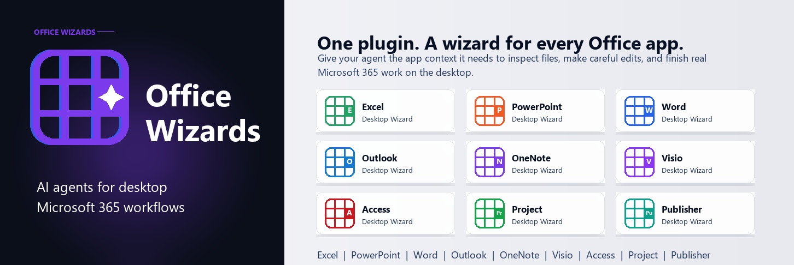

# Office Wizards



Office Wizards gives agents app-specific instructions for working with desktop Microsoft 365 files on Windows. Install the plugin, then ask your agent to use the right wizard for Excel, PowerPoint, Word, Outlook, OneNote, Access, Visio, Project, or Publisher.

## Install

Codex:

```text
codex plugin marketplace add officewizards/officewizards-agent-skills
codex plugin add office-wizards@office-wizards
```

Claude Code:

```text
/plugin marketplace add officewizards/officewizards-agent-skills
/plugin install office-wizards@office-wizards
```

Cursor:

```text
/add-plugin office-wizards
```

Agent Skills CLI:

```bash
npx skills add https://github.com/officewizards/officewizards-agent-skills
```

List the available skills before installing:

```bash
npx skills add https://github.com/officewizards/officewizards-agent-skills --list
```

## What It Does

Office Wizards helps agents work inside the apps where business documents already live. It gives the agent a clear playbook for each Office desktop app: how to inspect the current file, choose the right action, avoid risky changes, and leave the document in a useful state.

Use it when you want an agent to:

- analyze or clean an Excel workbook;
- build or revise a PowerPoint deck;
- draft, edit, or review a Word document;
- summarize Outlook mail or prepare a draft;
- organize OneNote pages and sections;
- create or refine Visio diagrams;
- work with Access databases, Project plans, or Publisher files.

## Included Wizards

- Excel Desktop Wizard
- PowerPoint Desktop Wizard
- Word Desktop Wizard
- Outlook Desktop Wizard
- OneNote Desktop Wizard
- Access Desktop Wizard
- Visio Desktop Wizard
- Project Desktop Wizard
- Publisher Desktop Wizard

## How To Use It

After installation, ask your agent for the outcome and name Office Wizards when you want it to route the work:

```text
Use Office Wizards to analyze this Excel workbook.
```

```text
Use Office Wizards to turn these notes into a PowerPoint deck.
```

```text
Use Office Wizards to summarize the selected Outlook emails and draft replies.
```

The agent will choose the matching desktop wizard and follow the app-specific workflow.
